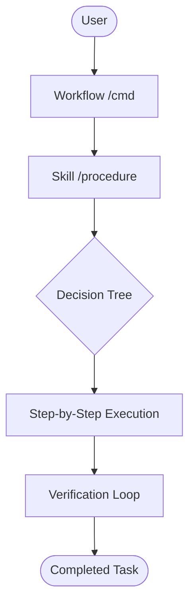
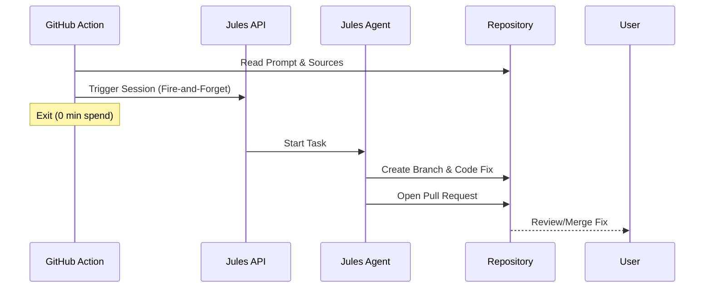

# The Agentic Protocol: Technical Deep Dive

## Introduction

This document describes the architectural philosophy and implementation of the **Agentic Development System**. It is designed to enable a "Symbiotic Development" pattern where human developers and AI agents collaborate within a governed, automated, and self-maintaining environment.

---

## 1. The Genesis: Gemini Gem

The lifecycle of an agentic project begins outside the repository, in a **Gemini Gem** (or a specialized system prompt). 

1. **Strategic Discovery**: The human provides high-level requirements to a specialized Gem.
2. **Intelligence Seeding**: The Gem outputs a `seeds/` directory containing:
   - `BOOTSTRAP.json`: A machine-readable manifest of the project's tech stack, hosting, and desired AI personas.
   - `docs/`: Human-centric documents (PRD, ARCHITECTURE.md) that define the "Intent" of the project.

---

## 2. The Scaffolding: Bootstrap & Governance

Once seeds exist, the infrastructure is hydrated using the **Template Bootstrap**:

1. **System Hybridization**: The `bootstrap` skill merges the template's agentic tools with the project's logic.
2. **Non-Negotiable Governance**: Every project inherits `AGENTS.md`. This is essentially the **Constitution** of the codebase. It defines:
   - **Idempotency Rules**: Preventing redundant AI operations.
   - **Append-Only Logs**: Ensuring an immutable audit trail.
   - **PR Hygiene**: Standardizing how changes enter the system.
3. **Tool Tracking**: `VERSIONS.md` tracks the "Environment Health," ensuring the AI and humans are using the same pinned tool versions.

---

## 3. The Execution Layer: Workflows & Skills

Development is executed via a structured hierarchy:

- **Workflows (Entry Points)**: High-level intentions (e.g., `/test`, `/review`, `/template-sync`). These are simple entry points for common developer tasks.
- **Skills (Procedures)**: Detailed, multi-step procedures located in `.agent/skills/`. 
  - Skills are written for **AI readability**. They use decision trees and checklists to ensure the agent follows a consistent, high-quality path.

---

## 4. The "Night Shift": Jules Maintenance Loop

Automation is handled by **Jules**, an asynchronous agentic system triggered via GitHub Actions.

1. **Trigger**: Cron schedules or `workflow_dispatch` trigger the GHA workflow.
2. **Hand-Off**: GHA reads a prompt from `.jules/prompts/` and calls the Jules API.
3. **Fire-and-Forget**: GHA exits immediately to save runner minutes. Jules executes in the background.
4. **Resolution**: Jules creates a Pull Request with the fix (e.g., security patch, formatting, dependency bump).

---

## 5. Security & Stability

The system is designed with "Glass Box" visibility:
- **Sentinel**: Continuous security monitoring.
- **Compliance Log**: Every major agentic action is recorded in `COMPLIANCE_LOG.md`.
- **Pre-commit**: Local enforcement via `ruff`, `mypy`, and `detect-secrets` before any code reaches the repository.

---

_This protocol ensures that as the codebase grows, the agentic infrastructure scales alongside it, maintaining high standards of quality and security without constant human oversight._
